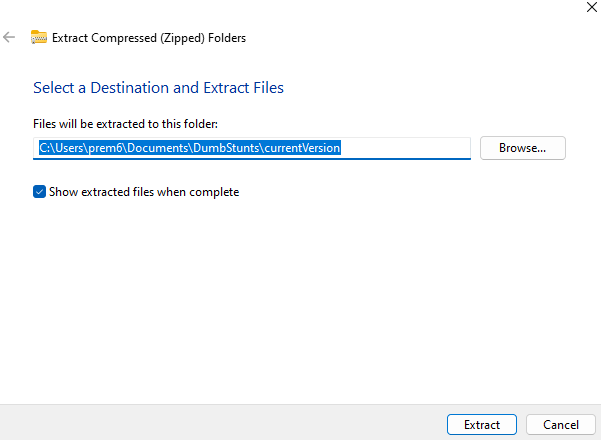
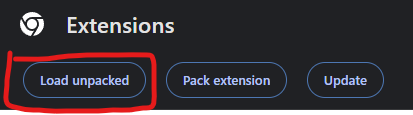
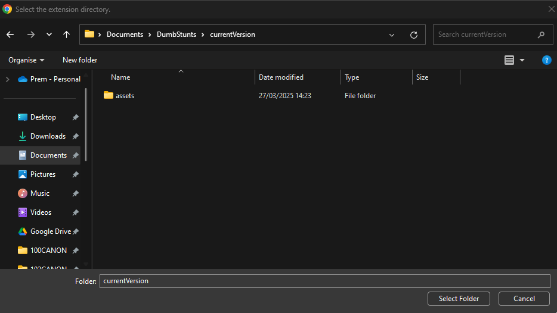
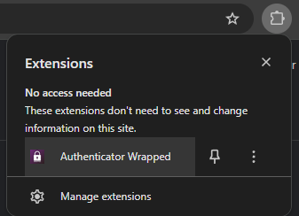

# Authenticator Wrapped #

## Introduction ##

Are you a university student, or indeed anywhere else. Does your institution use the Microsoft apps, and require Microsoft Authenticator every time you log on with a code? 

At Durham University, we do too, with policies so strict that it signs the account out at random times. 

Inspired by [Durfess #37281](https://www.facebook.com/hashtag/durfess37281), why not make this come true?

## Installation ##

Chrome Web Store: Pending (it costs money for some reason :/)

Firefox: Pending

### Manual Installation (Chrome) ### 

1. Download "currentVersion.zip"

2. Unzip it into a folder on your computer that you will not delete

3. Open Chrome, and go to `chrome://extensions/`, and toggle on the "Developer Mode" in the top right corner

4. Press the "Load Unpacked" button

5. Locate the folder "currentVersion", or whatever you unzipped everything containing the `manifest.json` file into with that
popup prompt. Once you get to that folder, press "Select Folder" (or alternative button for other operating systems)

6. Now, to access the extension, go to the extensions menu, and you can now be happy!

Please note that it may say in the extensions area that there are "Errors" - do not worry.

## Credits ##

Of course, this project could not be done without any help! Thanks to:

- [James Davenport, @JDavenport426](https://github.com/JDavenport426) - for the help in statistics generation
- [Aman Pratap Singh, @Aman07122003](https://github.com/Aman07122003) - for the help in making the browser extension popup look better